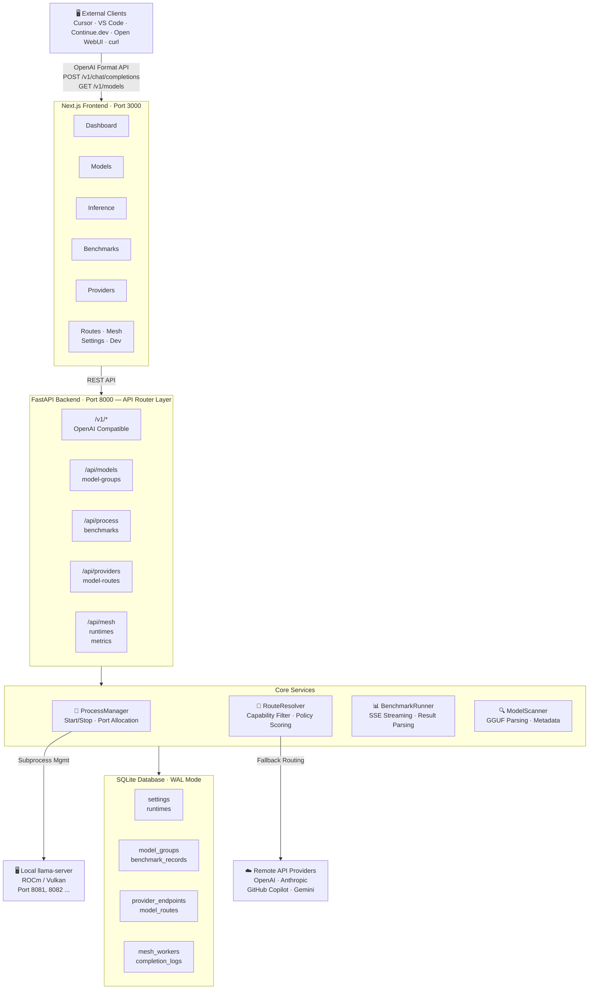

# LLM Server Router

A high-performance local LLM routing system optimized for AMD Radeon 890M (Strix Point) hardware, featuring multi-process model management, automated benchmarking, and an OpenAI-compatible API router with intelligent local/remote fallback.

## 🌟 Overview

The LLM Server Router is the central hub for your local language models, specifically optimized for AMD hardware with unified memory (e.g., 64GB on Strix Point). It provides:

- **Local Model Management**: Discover, organize, and manage `.gguf` models with automatic metadata extraction (publisher, quantize, param size, architecture).
- **Smart Routing & Fallback**: OpenAI-compatible API endpoint — routes to local `llama-server` instances first, falls back to external APIs (OpenAI/Anthropic) if unavailable.
- **Multi-Runtime Support**: Seamlessly switch between `llama.cpp` backends (ROCm, Vulkan) with per-model environment variable injection (e.g., `HSA_OVERRIDE_GFX_VERSION`).
- **Automated Benchmarking**: Built-in `llama-bench` integration with customizable parameters (batch sizes, GPU layers, flash attention, KV offload, prompt/generation token counts), real-time debug log streaming, and JSON import/export.
- **Mesh Networking**: Tailscale-based multi-node routing — pool GPUs across multiple machines behind a single API endpoint.
- **Remote Access Ready**: Serve local models to other devices on your network; integrate with Cursor, Continue.dev, Open WebUI, and other OpenAI-compatible clients.

## 🏗️ Architecture



## ✨ Features

### Model Management
- **Multi-directory scanning** with recursive `.gguf` file discovery
- **Automatic metadata parsing** from filenames: publisher, quantize type (Q4_K_M, Q5_K_S, etc.), parameter size (7B, 9B, 70B), and model architecture
- **Model Group presets** with configurable parameters (NGL, batch, ubatch, context size, engine type)
- **Two-column layout** — groups and discovered files displayed side-by-side
- **One-click launch** — start llama-server with saved presets

### Benchmarking
- **Multi-parameter sweep** — specify comma-separated batch sizes and GPU layer counts for automated grid testing
- **Customizable test parameters** — prompt tokens (pp), generation tokens (tg), flash attention, KV offload
- **Real-time debug log** with auto-scroll and clear functionality
- **Results table** with best-score highlighting and scrollable history
- **Import/Export** benchmark records as JSON for backup and cross-device comparison

### API Router
- **OpenAI-compatible** `/v1/chat/completions` endpoint
- **Automatic routing** to running local models by name matching
- **Graceful fallback** to OpenAI, Anthropic, GitHub Copilot, or Gemini
- **6 routing policies** — `local_first`, `local_only`, `remote_only`, `fastest`, `cheapest`, `highest_quality`
- **Virtual Models** — stable logical model IDs with policy-based routing
- **Tool Calling** — automatic OpenAI ↔ Anthropic schema translation with argument validation

### Mesh Networking
- **Tailscale-based** multi-node cluster behind a single endpoint
- **Automatic health checks** (30s interval) with status transitions
- **Worker heartbeats** for dynamic model inventory

### Dashboard
- Real-time status monitoring of all running `llama-server` processes
- GPU/memory awareness for AMD Radeon 890M
- API request statistics (Local vs Remote ratio)
- Recent benchmark summary

## 🚀 Quick Start

### Prerequisites
- Linux OS (Ubuntu 22.04+ recommended)
- Python 3.10+
- Node.js 18+ (for frontend)
- `uv` Python package manager
- Compiled `llama.cpp` binaries (`llama-server`, `llama-bench`) — ROCm or Vulkan builds

### Installation

1. **Clone the repository:**
   ```bash
   git clone git@github.com:Starlee-0514/LLM_Server_Router.git
   cd LLM_Server_Router
   ```

2. **Set up environment variables:**
   ```bash
   cp .env.example .env
   ```
   Edit `.env` with your paths and API keys:
   ```env
   LLAMA_ROCM_PATH=/path/to/llama-server-rocm
   LLAMA_VULKAN_PATH=/path/to/llama-server-vulkan
   HSA_OVERRIDE_GFX_VERSION=11.5.0
   OPENAI_API_KEY=sk-...
   ANTHROPIC_API_KEY=sk-ant-...
   ```

3. **Install dependencies:**
   ```bash
   # Backend
   uv sync

   # Frontend
   cd frontend && npm install && cd ..
   ```

4. **Start the services:**
   ```bash
   # Terminal 1: Backend
   uv run uvicorn backend.app.main:app --reload --host 0.0.0.0 --port 8000

   # Terminal 2: Frontend
   cd frontend && npm run dev
   ```

5. **Open the dashboard:** Navigate to `http://localhost:3000`

> **API Docs**: Swagger UI available at `http://localhost:8000/docs`

## 📖 Documentation

| Document | Description |
| --- | --- |
| **[Full Guide (中文)](docs/FULL_GUIDE.md)** | Comprehensive guide in Traditional Chinese — architecture, setup, usage, API reference, FAQ |
| **[Full Guide (English)](docs/FULL_GUIDE_EN.md)** | Complete guide in English — same content as above |
| [Setup Guide](docs/SETUP.md) | Installation, configuration, and API usage |
| [Design Document](docs/DESIGN_DOC.md) | Architecture overview, core features, and technical stack |

## 🛠️ Tech Stack

| Layer | Technology |
| --- | --- |
| **Backend** | Python 3.10+, FastAPI, SQLAlchemy, Pydantic |
| **Frontend** | Next.js 16, React 19, Tailwind CSS 4, Shadcn/UI |
| **Database** | SQLite (WAL mode) |
| **Dependencies** | `uv` (Python), `npm` (Node.js) |
| **Core Engine** | `llama.cpp` (`llama-server`, `llama-bench`) |
| **Target Hardware** | AMD Radeon 890M (gfx1150), 64GB unified memory |

## 📁 Project Structure

```
LLM_Server_Router/
├── backend/
│   └── app/
│       ├── main.py                    # FastAPI app entry point
│       ├── models.py                  # SQLAlchemy ORM models (10 tables)
│       ├── schemas.py                 # Pydantic request/response schemas
│       ├── database.py                # Database session + auto-migration
│       ├── core/
│       │   ├── config.py              # Environment config (Settings)
│       │   ├── process_manager.py     # llama-server process lifecycle
│       │   ├── runtime_settings.py    # DB-backed settings + Runtime env
│       │   ├── dev_logs.py            # Dev logs (ring buffer)
│       │   ├── request_stats.py       # Request counter
│       │   └── provider_helpers.py    # Provider headers utility
│       ├── services/
│       │   ├── model_scanner.py       # GGUF file discovery & metadata
│       │   ├── benchmark_runner.py    # llama-bench execution & parsing
│       │   ├── route_resolver.py      # Route candidate scoring
│       │   ├── tool_normalizer.py     # Tool calling format conversion
│       │   ├── mesh_health.py         # Mesh Worker health check
│       │   └── system_metrics.py      # GPU/RAM metrics
│       └── api/routers/
│           ├── openai_router.py       # /v1/* (core routing logic)
│           ├── provider_routes.py     # Providers + Routes + Mesh + OAuth
│           ├── model_routes.py        # Model scanning + overrides
│           ├── model_group_routes.py  # Model Group CRUD
│           ├── process_routes.py      # Process control
│           ├── benchmark_routes.py    # Benchmark execution & history
│           ├── settings_routes.py     # System settings
│           ├── runtime_routes.py      # Runtime CRUD
│           ├── metrics_routes.py      # Metrics API
│           ├── report_routes.py       # Bug Reports
│           ├── dev_routes.py          # Dev tools
│           └── virtual_model_routes.py # Virtual Models
├── frontend/
│   └── src/
│       ├── app/                       # 11 pages (Dashboard, Models, Inference, ...)
│       ├── components/                # Sidebar + Shadcn/UI components
│       └── lib/
│           └── api.ts                 # API client + TypeScript types
├── docs/
│   ├── FULL_GUIDE.md                  # Complete guide (繁體中文)
│   ├── FULL_GUIDE_EN.md               # Complete guide (English)
│   ├── DESIGN_DOC.md                  # Design document
│   └── SETUP.md                       # Setup guide
├── .env.example
├── pyproject.toml
└── README.md
```

## 📝 License

This project is for personal and educational use.
