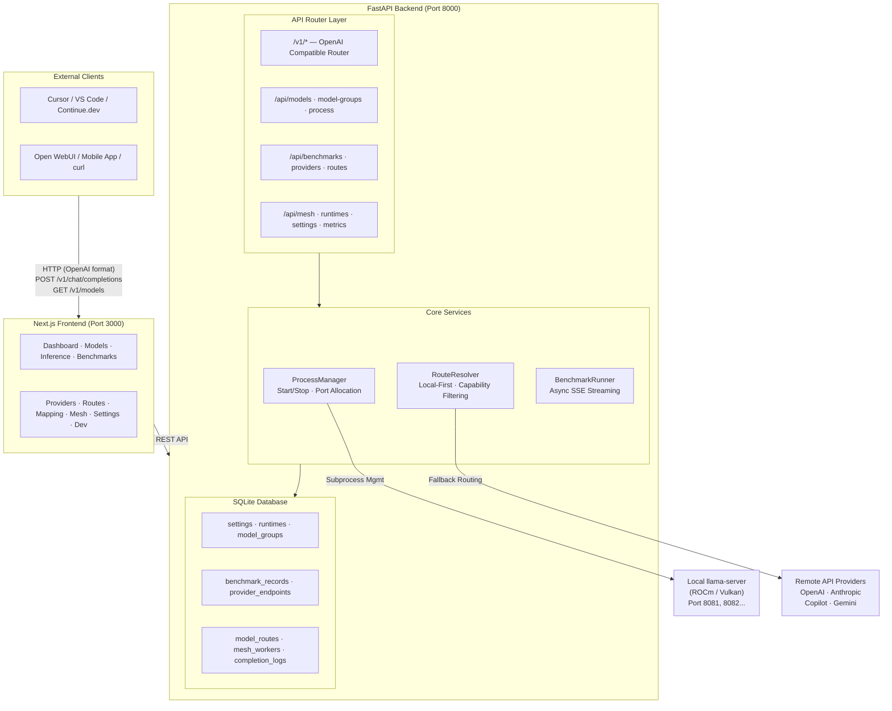

# LLM Server Router — Complete Guide

> **One-line summary**: LLM Server Router is a **local AI model management hub** that lets you launch local models with one click, run automated benchmarks, and expose a unified OpenAI-compatible API — with automatic fallback to cloud APIs (OpenAI / Anthropic / GitHub Copilot / Gemini) when local models are unavailable.

---

## Table of Contents

- [Who Is This For?](#who-is-this-for)
- [Core Concepts](#core-concepts)
- [System Architecture](#system-architecture)
  - [Backend Architecture](#backend-architecture)
  - [Frontend Architecture](#frontend-architecture)
  - [Database Schema](#database-schema)
- [Installation & Setup](#installation--setup)
- [Starting the Service](#starting-the-service)
- [Frontend Page Guide](#frontend-page-guide)
- [Complete API Reference](#complete-api-reference)
- [Advanced Features](#advanced-features)
  - [Tailscale Mesh Multi-Node Routing](#tailscale-mesh-multi-node-routing)
  - [Virtual Models](#virtual-models)
  - [Tool Calling](#tool-calling)
  - [Routing Policies](#routing-policies)
- [External Tool Integration](#external-tool-integration)
- [FAQ](#faq)
- [Project Structure](#project-structure)
- [Tech Stack](#tech-stack)

---

## Who Is This For?

| Your Need | How This Project Helps |
| --- | --- |
| I have an AMD GPU machine and want to run local models | ✅ Auto-manages llama-server processes, supports ROCm / Vulkan |
| I want my laptop / phone to use models on my desktop | ✅ Exposes OpenAI-compatible API, connect from any device on LAN |
| I want to use local models in Cursor / VS Code / Continue.dev | ✅ Fully OpenAI-compatible, just set the Base URL |
| Auto-switch to cloud when local models are busy | ✅ Built-in fallback: Local → Mesh → Cloud API |
| I want to compare performance of different model quantizations | ✅ Built-in llama-bench integration, one-click benchmarks |
| I want to pool GPUs across multiple machines | ✅ Tailscale Mesh supports multi-node routing |

---

## Core Concepts

Before getting started, understand a few key concepts:

### 🔑 What is GGUF?

GGUF is the model format used by `llama.cpp`. You can download various `.gguf` model files from [HuggingFace](https://huggingface.co/) (e.g., `Qwen3.5-9B-Q4_K_M.gguf`). Filenames typically contain:

| Part | Meaning | Example |
| --- | --- | --- |
| Architecture | Base model | Qwen3.5, Llama-3.1, Phi-4 |
| Param size | Model size | 7B, 9B, 70B |
| Quantize | Compression (higher = better quality, more memory) | Q4_K_M, Q5_K_S, Q8_0, F16 |

### 🔑 What is llama-server / llama-bench?

- **llama-server**: An inference server from `llama.cpp` that loads a GGUF model and exposes an API.
- **llama-bench**: A benchmarking tool that measures model inference speed (tokens/sec).

### 🔑 What is a Runtime?

Runtime = your compiled `llama.cpp` execution environment. Since AMD GPUs can use ROCm or Vulkan builds, the system lets you define multiple Runtimes, each pointing to different executables and environment variables.

### 🔑 What is a Model Group?

Model Group = a preset bundle of launch parameters. Package "model path + GPU Layers + Batch Size + Context Size + Runtime" into a group, then launch it with one click next time.

### 🔑 What is Routing?

When an external tool (e.g., Cursor) sends a request with `model: "gpt-4o"` to this system, routing decides where to forward it:
1. **Local llama-server** — if you have a running local model
2. **Mesh Worker** — if another machine on your network has the model running
3. **Cloud Provider** — OpenAI / Anthropic / GitHub Copilot / Gemini

---

## System Architecture



### Backend Architecture

The backend uses **Python FastAPI**. Module responsibilities:

| Module | Path | Responsibility |
| --- | --- | --- |
| **main.py** | `backend/app/main.py` | FastAPI entry point, lifecycle management, CORS, API token middleware |
| **config.py** | `backend/app/core/config.py` | Load global settings from `.env` (Pydantic Settings) |
| **database.py** | `backend/app/database.py` | SQLAlchemy Engine / Session / Auto-Migration |
| **models.py** | `backend/app/models.py` | 10 ORM table definitions |
| **schemas.py** | `backend/app/schemas.py` | Pydantic request / response models |
| **process_manager.py** | `backend/app/core/process_manager.py` | llama-server lifecycle (start, stop, port allocation, stderr monitor, phase detection) |
| **runtime_settings.py** | `backend/app/core/runtime_settings.py` | DB-backed settings, Runtime environment resolution |
| **model_scanner.py** | `backend/app/services/model_scanner.py` | Recursive `.gguf` scanning, metadata parsing (publisher, quantize, param_size, arch), mmproj linking |
| **benchmark_runner.py** | `backend/app/services/benchmark_runner.py` | Async llama-bench execution, SSE log streaming, result parsing |
| **route_resolver.py** | `backend/app/services/route_resolver.py` | Multi-source candidate collection → capability filtering → policy-based scoring |
| **tool_normalizer.py** | `backend/app/services/tool_normalizer.py` | OpenAI ↔ Anthropic tool schema translation, argument validation, loop protection |
| **mesh_health.py** | `backend/app/services/mesh_health.py` | Background health-check task (30s interval probe for Mesh Workers) |
| **system_metrics.py** | `backend/app/services/system_metrics.py` | Read CPU/GPU/RAM metrics from Linux sysfs |

#### Router Overview

| Router File | Endpoint Prefix | Function |
| --- | --- | --- |
| `openai_router.py` | `/v1/*` | OpenAI-compatible Chat Completions & Models |
| `model_routes.py` | `/api/models/*` | GGUF model scanning, property overrides |
| `model_group_routes.py` | `/api/model-groups/*` | Model Group CRUD + one-click launch |
| `process_routes.py` | `/api/process/*` | llama-server process control |
| `benchmark_routes.py` | `/api/benchmarks/*` | Benchmark execution (SSE streaming) |
| `settings_routes.py` | `/api/settings` | System settings KV store |
| `runtime_routes.py` | `/api/runtimes/*` | Runtime environment CRUD |
| `provider_routes.py` | `/api/providers/*` `/api/model-routes/*` `/api/mesh/*` | Provider endpoints, route rules, Mesh Workers, OAuth |
| `metrics_routes.py` | `/api/metrics/*` | System metrics, request stats, recent benchmarks |
| `report_routes.py` | `/api/reports/*` | Bug Report CRUD |
| `dev_routes.py` | `/api/dev/*` | Development debugging tools |
| `virtual_model_routes.py` | `/api/virtual-models/*` | Virtual Model CRUD |

### Frontend Architecture

The frontend uses **Next.js 16 + React 19 + Tailwind CSS 4 + Shadcn/UI**.

| Page | Path | Function |
| --- | --- | --- |
| **Dashboard** | `/` | System overview: backend status, active models, GPU/RAM usage, API request stats, recent benchmarks |
| **Models** | `/models` | Two-column layout: scanned GGUF files (left) + Model Group management (right), one-click launch/edit/delete |
| **Inference** | `/inference` | Online chat test interface with model selection and real-time streaming |
| **Benchmarks** | `/benchmarks` | Select model → configure parameters → run llama-bench → real-time log + results table |
| **Providers** | `/providers` | Manage remote API providers (OpenAI, Anthropic, Copilot, Gemini, etc.) |
| **Routes** | `/routes` | Manage model routing rules: model name → Provider mapping |
| **Mapping** | `/mapping` | Model property overrides, Model Family classification |
| **Mesh** | `/mesh` | Tailscale Mesh Worker node management |
| **Reports** | `/reports` | Bug Report submission and viewing |
| **Dev** | `/dev` | Development debugging: process event logs, real-time log streaming |
| **Settings** | `/settings` | System settings: scan directories, Runtime config, API Key management |

### Database Schema

Uses **SQLite** + **SQLAlchemy ORM**. Database file is `llm_router.db` (project root), automatically created on startup.

| Table | Purpose |
| --- | --- |
| `settings` | System settings key-value store (model_scan_dirs, api_token, ...) |
| `runtimes` | Runtime environment definitions (name, executable path, env vars) |
| `model_groups` | Model Group presets (bundled launch parameters) |
| `benchmark_records` | llama-bench test results |
| `provider_endpoints` | Remote API provider endpoints |
| `model_routes` | Model name → Provider routing rules |
| `model_property_overrides` | User-defined model property overrides |
| `mesh_workers` | Tailscale Mesh node registry |
| `completion_logs` | Per-request /v1/chat/completions log |
| `virtual_models` | Virtual model aliases |

---

## Installation & Setup

### Prerequisites

| Item | Requirement |
| --- | --- |
| **OS** | Linux (Ubuntu 22.04+ recommended) |
| **Python** | 3.10+ |
| **Node.js** | 18+ |
| **GPU** | AMD Radeon 890M (or any ROCm/Vulkan-capable GPU) |
| **RAM** | 16GB+ recommended (unified memory is better) |
| **llama.cpp** | Self-compiled `llama-server` and `llama-bench` (ROCm or Vulkan build) |

### Step 1: Clone the Repository

```bash
git clone git@github.com:Starlee-0514/LLM_Server_Router.git
cd LLM_Server_Router
```

### Step 2: Configure Environment Variables

```bash
cp .env.example .env
nano .env   # Edit the following fields
```

**.env Parameter Reference:**

| Variable | Description | Example |
| --- | --- | --- |
| `LLAMA_ROCM_PATH` | Path to ROCm build of llama-server | `/home/user/llama.cpp/build-rocm/bin/llama-server` |
| `LLAMA_VULKAN_PATH` | Path to Vulkan build of llama-server | `/home/user/llama.cpp/build-vulkan/bin/llama-server` |
| `HSA_OVERRIDE_GFX_VERSION` | AMD GPU arch override (Strix Point = 11.5.0) | `11.5.0` |
| `LLAMA_SERVER_PORT` | Starting listen port for llama-server | `8081` |
| `OPENAI_API_KEY` | OpenAI API Key (optional, for fallback) | `sk-...` |
| `ANTHROPIC_API_KEY` | Anthropic API Key (optional) | `sk-ant-...` |
| `DATABASE_URL` | SQLite path | `sqlite:///./llm_router.db` |

### Step 3: Install Dependencies

```bash
# Install uv (if not installed)
curl -LsSf https://astral.sh/uv/install.sh | sh

# Backend Python dependencies
uv sync

# Frontend Node.js dependencies
cd frontend && npm install && cd ..
```

### Step 4: Download GGUF Models

Download model files from HuggingFace to your preferred directory:

```bash
mkdir -p ~/models
# Use huggingface-cli or download directly from the browser
# Example: Qwen3.5-9B-Q4_K_M.gguf
```

---

## Starting the Service

### Development Mode (Recommended)

Open two terminal windows:

```bash
# Terminal 1: Backend
uv run uvicorn backend.app.main:app --reload --host 0.0.0.0 --port 8000

# Terminal 2: Frontend
cd frontend && npm run dev
```

### Verify

| Service | URL |
| --- | --- |
| Frontend UI | http://localhost:3000 |
| API Docs (Swagger) | http://localhost:8000/docs |
| Health Check | http://localhost:8000/ |

### What Happens Automatically on Startup

1. SQLite database is created (if it doesn't exist)
2. All tables are auto-initialized
3. Default `rocm` and `vulkan` Runtimes are created
4. Mesh Worker background health-check task starts (every 30s)
5. All llama-server processes are stopped on shutdown

---

## Frontend Page Guide

### 1️⃣ Dashboard — System Overview

Open `http://localhost:3000` to see:
- **Backend Status**: Backend connection status
- **Active Models**: Number of running models
- **GPU Usage**: AMD GPU utilization + VRAM
- **Memory Usage**: System RAM
- **API Requests Today**: Today's API request count (Local vs Remote ratio)
- **Recent Benchmarks**: Latest benchmark results
- **Running Processes**: Running llama-server list (PID, Engine, Port, Uptime)

### 2️⃣ Models — Model Management

**First time? Set up scan directories first:**

1. Go to **Settings** page
2. Set `model_scan_dirs` to your GGUF model directory (JSON array format): `["/home/user/models"]`
3. Return to **Models** page, click **Scan**

**Left column: Scanned files**
- Shows all discovered `.gguf` files
- Auto-parsed: Publisher, Quantize, Param Size, Architecture
- Search and filter support

**Right column: Model Groups**
- Click a file on the left → Create a Model Group (with default params)
- Configure: GPU Layers, Batch Size, Context Size, Runtime
- Click **Launch** → one-click llama-server startup
- Edit and delete support

### 3️⃣ Inference — Inference Testing

1. Select a model from dropdown (both local running and provider-routed models appear)
2. Type your message in the chat box
3. Streaming support — real-time response display
4. Adjustable temperature, max_tokens, top_p

### 4️⃣ Benchmarks — Performance Testing

1. Select the model to test (GGUF file path)
2. Configure test parameters:
   - **Batch sizes**: comma-separated (e.g., `128,256,512`)
   - **GPU Layers**: comma-separated (e.g., `999`)
   - **Prompt Tokens (pp)**: number of prompt processing tokens
   - **Generation Tokens (tg)**: number of generation tokens
   - **Flash Attention**: on / off
   - **KV Offload**: on / off
3. Click **Run** → watch real-time debug log (streaming output)
4. Results auto-saved to database; table shows pp t/s and tg t/s
5. Supports **Export JSON** (backup) and **Import JSON** (cross-device comparison)

### 5️⃣ Providers — Provider Management

Manage your available remote APIs:

| Type | Auth Method |
| --- | --- |
| OpenAI | API Key |
| Anthropic | API Key |
| GitHub Copilot | Device Code OAuth |
| GitHub Models | Device Code OAuth |
| Google Gemini CLI | Google OAuth (PKCE) |
| Any OpenAI-compatible API | Custom Base URL + API Key |

Click **Add Provider** → fill in details → automatic health check.

### 6️⃣ Routes — Routing Rules

Define "when model name X is requested, forward to which Provider":

- **Match Type**: `exact` (exact match) or `prefix` (prefix match)
- **Match Value**: model name to match (e.g., `gpt-4o`)
- **Target Model**: model name to use when forwarding to Provider
- **Provider**: target provider
- **Priority**: lower number = higher priority

### 7️⃣ Settings — System Settings

| Setting Key | Description |
| --- | --- |
| `model_scan_dirs` | GGUF scan directories (JSON array) |
| `default_engine` | Default Runtime (rocm / vulkan) |
| `api_token` | API Token protection (once set, /v1/* requires Bearer Token) |

---

## Complete API Reference

> 💡 Interactive Swagger docs available at `http://localhost:8000/docs` after startup.

### OpenAI-Compatible Endpoints

```bash
# List available models
curl http://localhost:8000/v1/models

# Send Chat Completion (non-streaming)
curl -X POST http://localhost:8000/v1/chat/completions \
  -H "Content-Type: application/json" \
  -d '{
    "model": "Qwen3.5-9B-Q4_K_M",
    "messages": [{"role": "user", "content": "Hello!"}]
  }'

# Streaming mode
curl -X POST http://localhost:8000/v1/chat/completions \
  -H "Content-Type: application/json" \
  -d '{
    "model": "Qwen3.5-9B-Q4_K_M",
    "messages": [{"role": "user", "content": "Hello!"}],
    "stream": true
  }'

# Specify routing policy
curl -X POST http://localhost:8000/v1/chat/completions \
  -H "Content-Type: application/json" \
  -H "X-Route-Policy: fastest" \
  -d '{"model": "gpt-4o", "messages": [{"role": "user", "content": "Hi"}]}'
```

### Core API

```bash
# ─── Health & Status ───
GET  /                          # Health check
GET  /api/status                # All llama-server status

# ─── Model Scanning ───
GET  /api/models/scan           # Scan configured directories
POST /api/models/scan           # Scan specified directories {"directories": [...]}

# ─── Model Groups ───
GET    /api/model-groups        # List all groups
POST   /api/model-groups        # Create group
PUT    /api/model-groups/{id}   # Update group
DELETE /api/model-groups/{id}   # Delete group
POST   /api/model-groups/{id}/launch  # One-click launch

# ─── Process Control ───
POST /api/process/start         # Start llama-server
POST /api/process/stop/{id}     # Stop
GET  /api/process/status        # All process status

# ─── Benchmarks ───
POST /api/benchmarks/run        # Execute test (SSE streaming)
GET  /api/benchmarks/history    # History records
POST /api/benchmarks/import     # Import records
DELETE /api/benchmarks/{id}     # Delete record

# ─── Settings ───
GET  /api/settings              # Get all settings
PUT  /api/settings              # Batch update

# ─── Runtime ───
GET    /api/runtimes            # List all runtimes
POST   /api/runtimes            # Create
PUT    /api/runtimes/{id}       # Update
DELETE /api/runtimes/{id}       # Delete

# ─── Provider ───
GET    /api/providers                    # List
POST   /api/providers                    # Create
PUT    /api/providers/{id}               # Update
DELETE /api/providers/{id}               # Delete
GET    /api/providers/{id}/health        # Health check
GET    /api/providers/{id}/models        # List Provider models
GET    /api/providers/common/templates   # Common Provider templates

# ─── Route Rules ───
GET    /api/model-routes        # List
POST   /api/model-routes        # Create
PUT    /api/model-routes/{id}   # Update
DELETE /api/model-routes/{id}   # Delete

# ─── Mesh ───
GET  /api/mesh/workers                   # List nodes
POST /api/mesh/workers/heartbeat         # Register / heartbeat
DELETE /api/mesh/workers/{id}            # Remove node

# ─── Metrics ───
GET /api/metrics/requests       # Today's request stats
GET /api/metrics/system         # GPU / RAM metrics
GET /api/metrics/benchmarks/recent  # Recent Benchmarks
```

---

## Advanced Features

### Tailscale Mesh Multi-Node Routing

Connect multiple machines via Tailscale VPN to form a model cluster:

**Architecture:**
- **Hub node**: runs LLM Server Router, exposes a single endpoint
- **Worker nodes**: run any OpenAI-compatible framework (llama.cpp, vLLM, SGLang...)

**Setup Steps:**

```bash
# 1. Register Worker Provider on Hub
curl -X POST http://hub:8000/api/providers \
  -H "Content-Type: application/json" \
  -d '{"name":"worker-a","provider_type":"openai_compatible","base_url":"http://worker-a:8000","enabled":true}'

# 2. Create routing rule
curl -X POST http://hub:8000/api/model-routes \
  -H "Content-Type: application/json" \
  -d '{"route_name":"qwen","match_type":"prefix","match_value":"qwen","target_model":"Qwen3.5-9B","provider_id":1,"priority":10,"enabled":true}'

# 3. Worker sends heartbeat periodically (optional, Hub can also probe actively)
curl -X POST http://hub:8000/api/mesh/workers/heartbeat \
  -H "Content-Type: application/json" \
  -d '{"node_name":"worker-a","base_url":"http://worker-a:8000","models":["Qwen3.5-9B"],"status":"online"}'
```

Hub auto health-checks every 30 seconds, transitions: `online → stale (2 failures) → offline (5 failures) → online (recovered)`

### Routing Policies

Set via `X-Route-Policy` header or Virtual Model's routing_hints:

| Policy | Behavior |
| --- | --- |
| `local_first` (default) | Local → Mesh → Cloud |
| `local_only` | Local models only |
| `remote_only` | Remote only |
| `fastest` | Pick the model with best benchmark score |
| `cheapest` | Prefer free (Local → Mesh → OpenAI → Anthropic) |
| `highest_quality` | Prefer quality (Anthropic → OpenAI → Mesh → Local) |

### Virtual Models

Create stable logical model IDs regardless of the underlying model:

```bash
curl -X POST http://localhost:8000/api/virtual-models \
  -H "Content-Type: application/json" \
  -d '{
    "model_id": "coding",
    "display_name": "Best coding model",
    "routing_hints": {"preferred_policy": "fastest", "requires_tools": true}
  }'
```

External tools just specify `model: "coding"`, and the Router automatically picks the best backend.

### Tool Calling

The system automatically handles OpenAI-format tool calling:
- **OpenAI / OpenAI-compatible providers**: direct passthrough
- **Anthropic providers**: automatic tools schema translation
- **Argument validation**: auto-checks if model-returned arguments match the schema
- **Loop protection**: default max 10 tool call iterations

---

## External Tool Integration

### Cursor

1. Settings → Models → OpenAI API Key: enter any value
2. API Base URL: `http://<your-IP>:8000/v1`

### Continue.dev (VS Code)

```json
// ~/.continue/config.json
{
  "models": [{
    "title": "Local Router",
    "provider": "openai",
    "model": "Qwen3.5-9B-Q4_K_M",
    "apiBase": "http://<your-IP>:8000/v1",
    "apiKey": "any"
  }]
}
```

### Open WebUI

Settings → OpenAI API URL: `http://<your-IP>:8000/v1`

### Remote Access via SSH Tunnel

```bash
ssh -L 8000:localhost:8000 user@your-server-ip
# Then access http://localhost:8000 locally
```

---

## FAQ

### Q: `HSA_OVERRIDE_GFX_VERSION` errors

Make sure `.env` has `HSA_OVERRIDE_GFX_VERSION=11.5.0`. This is the required override for AMD Strix Point architecture.

### Q: llama-server fails to start

1. Verify `.env` paths point to correct binaries
2. Ensure execute permissions: `chmod +x /path/to/llama-server`
3. Test manually: `/path/to/llama-server --help`
4. Check the **Dev** page process logs for specific errors

### Q: Can't find any models

1. Verify `model_scan_dirs` is set in Settings
2. Confirm the directory exists and is readable
3. Confirm file extension is `.gguf` (case-sensitive)

### Q: Reset database

```bash
rm llm_router.db llm_router.db-shm llm_router.db-wal
# Restart the service to auto-create
```

### Q: Frontend can't connect to backend

Frontend defaults to `http://<current-page-hostname>:8000` as the API URL. If the backend is on a different host/port, set the `NEXT_PUBLIC_API_URL` environment variable.

### Q: How to protect the API?

Set `api_token` in Settings. Once set, all `/v1/*` endpoints require an `Authorization: Bearer <token>` or `X-API-Key: <token>` header.

---

## Project Structure

```
LLM_Server_Router/
├── backend/
│   ├── __init__.py
│   └── app/
│       ├── main.py                        # FastAPI entry point
│       ├── models.py                      # 10 ORM tables
│       ├── schemas.py                     # Pydantic schemas
│       ├── database.py                    # DB Engine + Migration
│       ├── core/
│       │   ├── config.py                  # .env config loader
│       │   ├── process_manager.py         # llama-server process management
│       │   ├── runtime_settings.py        # DB settings + Runtime resolution
│       │   ├── dev_logs.py                # Dev logs (ring buffer)
│       │   ├── request_stats.py           # Request counter
│       │   └── provider_helpers.py        # Provider headers utility
│       ├── services/
│       │   ├── model_scanner.py           # GGUF file scan + metadata parsing
│       │   ├── benchmark_runner.py        # llama-bench async execution
│       │   ├── route_resolver.py          # Route candidate scoring
│       │   ├── tool_normalizer.py         # Tool calling format conversion
│       │   ├── mesh_health.py             # Mesh Worker health check
│       │   ├── system_metrics.py          # GPU/RAM metrics
│       │   └── adapters/
│       │       ├── base.py                # Provider adapter base class
│       │       ├── openai_adapter.py      # OpenAI adapter
│       │       └── anthropic_adapter.py   # Anthropic adapter
│       └── api/routers/
│           ├── openai_router.py           # /v1/* (core routing logic)
│           ├── provider_routes.py         # Provider + Routes + Mesh + OAuth
│           ├── model_routes.py            # Model scanning + property overrides
│           ├── model_group_routes.py      # Model Group CRUD
│           ├── process_routes.py          # Process control
│           ├── benchmark_routes.py        # Benchmark execution & history
│           ├── settings_routes.py         # System settings
│           ├── runtime_routes.py          # Runtime CRUD
│           ├── metrics_routes.py          # Metrics API
│           ├── report_routes.py           # Bug Reports
│           ├── dev_routes.py              # Dev tools
│           └── virtual_model_routes.py    # Virtual Models
├── frontend/
│   ├── package.json                       # Node.js dependencies
│   ├── next.config.ts                     # Next.js config
│   └── src/
│       ├── app/
│       │   ├── layout.tsx                 # Global layout (dark mode, Geist font)
│       │   ├── globals.css                # Tailwind + theme variables
│       │   ├── page.tsx                   # Dashboard
│       │   ├── models/page.tsx            # Model Management
│       │   ├── inference/page.tsx         # Inference Testing
│       │   ├── benchmarks/page.tsx        # Benchmark Testing
│       │   ├── providers/page.tsx         # Provider Management
│       │   ├── routes/page.tsx            # Routing Rules
│       │   ├── mapping/page.tsx           # Model Mapping
│       │   ├── mesh/page.tsx              # Mesh Management
│       │   ├── reports/page.tsx           # Bug Reports
│       │   ├── dev/page.tsx               # Dev Debugging
│       │   └── settings/page.tsx          # System Settings
│       ├── components/
│       │   ├── sidebar.tsx                # Sidebar navigation
│       │   └── ui/                        # Shadcn/UI components
│       └── lib/
│           ├── api.ts                     # API Client + TypeScript types
│           ├── model-preset-recipes.ts    # Preset parameter templates
│           └── utils.ts                   # Utility functions
├── docs/
│   ├── FULL_GUIDE.md                      # Complete guide (Chinese)
│   ├── FULL_GUIDE_EN.md                   # ← You are reading this file
│   ├── DESIGN_DOC.md                      # Original design document
│   ├── SETUP.md                           # Setup guide
│   └── auto-catch-up.md                   # Changelog
├── .env.example                           # Environment variables example
├── pyproject.toml                         # Python dependency definitions
├── uv.lock                                # Python dependency lockfile
└── README.md                              # Project README
```

---

## Tech Stack

| Layer | Technology | Version | Purpose |
| --- | --- | --- | --- |
| **Backend Framework** | FastAPI | ≥ 0.115 | Async REST API, auto-docs |
| **ORM** | SQLAlchemy | ≥ 2.0 | Database access |
| **Validation** | Pydantic | ≥ 2.0 | Request/response model validation |
| **HTTP Client** | httpx | ≥ 0.28 | Async HTTP requests (forwarding to Providers) |
| **Database** | SQLite | — | Lightweight embedded DB (WAL mode) |
| **Frontend Framework** | Next.js | 16 | React SSR framework |
| **UI Library** | React | 19 | Component-based UI |
| **CSS Framework** | Tailwind CSS | 4 | Utility-first CSS |
| **UI Components** | Shadcn/UI | 4 | Pre-built UI components |
| **Python Package Mgr** | uv | — | Ultra-fast modern Python package manager |
| **Inference Engine** | llama.cpp | — | GGUF model inference (llama-server, llama-bench) |
| **Target Hardware** | AMD Radeon 890M | gfx1150 | Strix Point, 64GB unified memory |

---

> **Getting started?** Follow this order: **Install → Start → Dashboard → Settings (set scan dirs) → Models (scan + launch model) → Inference (test chat)**. Check the Dev page's real-time logs if you run into issues.
